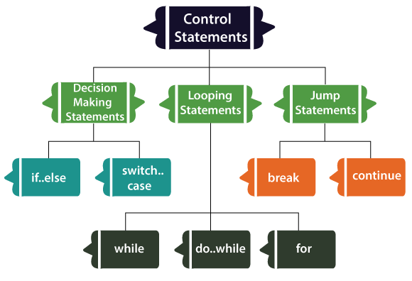

# Control Flow Statements

## Decision Making Statements

### If else statements

~~~Dart

    if(condition) {
        // statement [1]
        // .
        // .
        // .
        // statement [n]
    } else {
        // statement [1]
        // .
        // .
        // .
        // statement [n]
    }

~~~

#### if else if statements

~~~Dart

    if (condition) {
        // statement [1]
        // .
        // .
        // .
        // statement [n]
    } else if (condition) {
        // statement [1]
        // .
        // .
        // .
        // statement [n]
    } else {
        // statement [1]
        // .
        // .
        // .
        // statement [n]
    }

~~~

#### Nesned if statements

~~~Dart

    if (condition) {
        if (condition) {
        // statement [1]
        // .
        // .
        // .
        // statement [n]
        } else {
            // statement [1]
            // .
            // .
            // .
            // statement [n]
        }
    } else {
        // statement [1]
        // .
        // .
        // .
        // statement [n]
    }

~~~

### Switch and case

~~~Dart

    switch (expression) {
        case value_1:
        {
            // statement [1]
            // .
            // .
            // .
            // statement [n]
        }
        break;
        
        case value_n:
        {
            // statement [1]
            // .
            // .
            // .
            // statement [n]
        }
        break;

        default:
        {
            // statement [1]
            // .
            // .
            // .
            // statement [n]
        }
    }

~~~

~~~Dart

    var command = "OPEN";

    switch (command) {
        case "CLOSED":
            executeClosed();
            break;
        case "PENDING":
            executePending();
            break;
        case "APPROVED":
            executeApproved();
            break;
        case "DENIED":
            executeDenied();
            break;
        case "OPEN":
            executeOpen();
            break;
        default:
            executeUnknown();
    }

~~~

~~~Dart

    // Switch Case and Continue Example

    var command = "PENDING";

    switch (command) {
        case "CLOSED":
            executeClosed();
            break;
        case "PENDING":
            executePending();
            continue nowClosed;
        case "APPROVED":
            executeApproved();
            break;
        case "DENIED":
            executeDenied();
            break;
        nowClosed:
        case "NOW_CLOSED":
            executeNowClosed();
            break;
        case "OPEN":
            executeOpen();
            break;
        default:
            executeUnknown();
    }

~~~

---

## Looping Statements

### While loops

~~~Dart

    while (condition) {
        // statement [1]
        // .
        // .
        // .
        // statement [n]
    }

~~~

### Do while loops

~~~Dart

    do {
        // statement [1]
        // .
        // .
        // .
        // statement [n]
    } while (condition);

~~~

### For loops

~~~Dart

    for (initialization; condition; increment) {
        // statement [1]
        // .
        // .
        // .
        // statement [n]
    }

~~~

#### For-in loops

~~~Dart

    // Range-based for loop
    for (var var_name in expression) {
        // can use var_name

        // statement [1]
        // .
        // .
        // .
        // statement [n]
    }

~~~

## Jump Statements

~~~Dart

~~~

### break

~~~Dart

    while (condition) {
        // statement [1]
        // .
        // .
        // .
        // statement [n]

        break;
    }

~~~

### continue

~~~Dart

    while (condition) {
        // statement [1]
        // .
        // .
        // .
        // statement [n]

        continue;
    }

~~~
